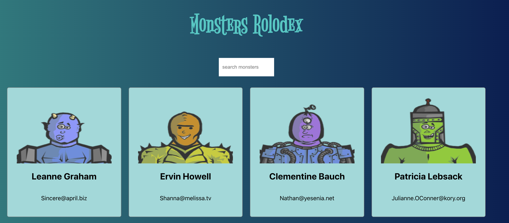

<blockquote align="center">“Keep it Simple, Stupid”!</blockquote>

<h3 align="center"> Monster Rolodex </h3>

  
  

I started this application for developing my skills in javaScript with some frameworks ReactJS.

**Template**

### Tools

- ESLint + Prettier + EditorConfig;

#### Dependencies

-ReactJs

#### Project Link
[Project](https://guilhermeseckert.github.io/monsters-rolodex/)

<h1 align="center" border-radius= "50%">
  
</h1>

Made with by Guilherme S.Eckert [Get in touch!](https://www.linkedin.com/in/guilherme-eckert/)
